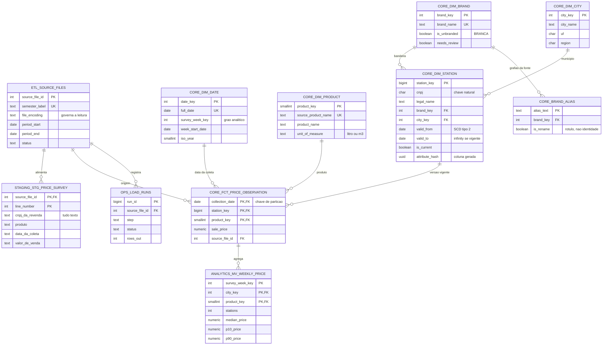

# Modelo de dados completo

Todas as tabelas com chave estrangeira, nas cinco camadas. O núcleo dimensional
sozinho está no [README](../README.md#modelo-de-dados).

Não aparecem aqui, por não terem chave estrangeira: as views de `analytics`
(série semanal, dispersão, paridade, efeito de bandeira, cobertura), as views de
saúde em `ops`, e as dezessete partições do fato, que são objetos físicos da
mesma tabela.

## Como ler

**O catálogo alcança as três pontas.** `etl.source_files` liga-se à staging, ao
fato e ao registro de execuções. É por isso que rastrear uma observação até o
arquivo que a trouxe, com o encoding e o layout usados na leitura, é uma consulta
e não uma investigação.

**`brand_alias` pendura em `dim_brand`, não em `dim_station`.** A normalização de
grafia acontece uma vez, no catálogo. Se estivesse na dimensão de postos, cada
carga precisaria reaplicá-la, e duas grafias da mesma empresa abririam versões
distintas no SCD Tipo 2.

**A staging referencia o catálogo, não o contrário.** A tabela bruta é truncada a
cada arquivo; o catálogo permanece. A chave primária composta de arquivo e número
de linha é o que permite apontar uma rejeição para a linha exata do CSV.

**`mv_weekly_price` deriva do fato sem chave estrangeira formal.** A ligação no
diagrama registra a dependência lógica: ela agrega o fato por semana, município e
produto, e o município vem da versão do posto vigente na data da observação, não
da atual.
